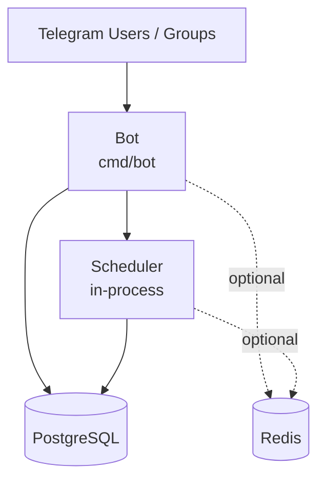

# Sola

[中文（简体）](./README.md) | English

[](./LICENSE)
[](https://t.me/+gbitAgNwtRtlYjZh)
[](https://go.dev/)
[](https://core.telegram.org/bots)

Sola is an open-source Telegram group operations bot built as a **single Bot process with an embedded scheduler**. It is designed for solo operators who want to run and iterate on a real Telegram group product over the long term, not just deploy a single-purpose script bot.

## Features

| Module | Capabilities |
|--------|-------------|
| **Points** | Score by message type, cooldown anti-spam, leaderboard, history, manual adjustment, daily sign-in |
| **Moderation** | Ban/unban/mute/kick/warn, bulk delete messages, welcome messages, promote/demote admins, titles, ghost cleanup |
| **Join Verification** | 6 verification types (button / captcha / multi-choice / Poll / math / Cloudflare Turnstile Mini App) |
| **Risk Control** | Keyword filtering, link restrictions, unverified-user limits, AI spam detection (OpenAI-compatible), violation records |
| **Content Ops** | Auto-replies, message templates, invite link tracking, level system, sed inline text correction |
| **Scheduled Posts** | One-time and recurring tasks, rich media (image/video/file), Inline Keyboard, auto-delete |
| **Lottery** | Button and keyword participation, group announcements, scheduler-driven auto-draw |
| **Engineering** | Docker Compose, SQL migrations, multi-tenant isolation, owner-scoped access, granular admin permissions |

## Architecture



## Tech Stack

| Layer | Technologies |
|-------|-------------|
| Backend | Go · gotgbot/v2 · GORM · gocron |
| Storage | PostgreSQL · Redis (optional) |
| Deployment | Docker · Docker Compose |

## Repository Layout

```text
cmd/
  bot/        Telegram Bot entry with embedded scheduler
internal/
  bot/        Telegram handlers, commands, flows
  config/     Configuration loading
  model/      GORM models
  service/    Business logic
  store/      DB / Redis initialization (Redis is optional)
database/
  migrations/ SQL migration files (applied in filename order)
```

## Quick Start

### 1. Configure environment variables

```bash
cp .env.example .env
```

> **Note**: `config.yaml` is not required. All settings can be provided via environment variables. `config.yaml` is only used for local development; production deployments use `.env` only.

**Required:**

| Variable | Description |
|----------|-------------|
| `SOLA_BOT_TOKEN` | Telegram Bot Token (from @BotFather) |
| `SOLA_DATABASE_DSN` | PostgreSQL connection string |

**Cloudflare Turnstile (optional — required only when using the `turnstile` verification type):**

| Variable | Description |
|----------|-------------|
| `SOLA_BOT_MINI_APP_URL` | Mini App URL used to generate verification links |
| `SOLA_TURNSTILE_SITE_KEY` | From Cloudflare Dashboard → Turnstile |
| `SOLA_TURNSTILE_SECRET_KEY` | From Cloudflare Dashboard → Turnstile |
| `SOLA_TURNSTILE_VERIFY_SECRET` | HMAC signing key for join-request links — `openssl rand -base64 32` |

### 2. Start all services

```bash
docker compose up -d --build
```

Compose starts services in order: `postgres` → `migrate` (runs pending `*.up.sql` files) → `bot`. Redis remains optional and is enabled by setting `SOLA_REDIS_ADDR`.

### 3. Local development

```bash
go run ./cmd/bot
```

## Join Verification

Configure with `/set_verify type <type>`:

| Type | Method |
|------|--------|
| `button` | Click an "I am human" button |
| `captcha` | Enter a random numeric code |
| `multi_choice` | Custom question with multiple-choice buttons |
| `poll` | Native Telegram quiz poll |
| `math` | Random arithmetic — pick 1 of 4 answers |
| `turnstile` | Cloudflare Turnstile + Mini App: the bot sends the applicant a private WebApp link; the join request is approved automatically after they pass the challenge |

> **Turnstile prerequisites**: configure the Turnstile environment variables above and enable "Join Request Approval" in the group settings.

Additional options:
- `/set_verify difficulty easy|medium|hard` — adjust timeout and retry limits
- `/allowuser @user` — whitelist a user to skip verification
- `/verify_stats` — view today's approved / declined / timed-out counts

## Bot Command Reference

<details>
<summary>Show full command list</summary>

**Core**: `/start` `/menu` `/settings` `/help` `/info` `/bind` `/check_admin`

**Points**: `/points` `/rank` `/sign` `/points_config` `/set_points` `/set_cooldown` `/points_toggle`

**Moderation**: `/ban` `/bans` `/unban` `/mute` `/unmute` `/kick` `/warn` `/warns` `/unwarn` `/purge` `/del` `/promote` `/demote` `/set_title` `/report` `/ban_ghosts` `/violations` `/resolve_violation` `/ignore_violation`

**Verification**: `/adminconfig` `/set_welcome` `/set_warn_limit` `/verify_toggle` `/set_verify` `/verify_stats`

**Rules**: `/setrules` `/clearrules` `/rules`

**Content Ops**: `/add_keyword` `/del_keyword` `/keywords` `/add_reply` `/del_reply` `/replies` `/add_template` `/del_template` `/templates` `/invite_create` `/invite_delete` `/invites` `/set_level` `/levels` `/add_level` `/del_level`

**Posts**: `/posts` `/publish` `/post_create` `/post_toggle` `/post_delete`

**Lottery**: `/lottery`

**Stats**: `/stat` `/stat_week` `/stats`

</details>

## Security

- Chat-scoped operations validate Telegram administrator status and owner access where possible
- Moderation actions (ban/mute/kick/keyword match) are written to `audit_logs`
- Redis is optional and powers cooldowns, caches, and selected rate limits; the Bot still starts when Redis is not configured

**Before going live**: configure TLS and a domain, enable PostgreSQL persistence, enable Redis persistence if you use Redis, and validate all core flows in a test group first.

## Database and Migrations

All schema changes are managed through `database/migrations/`; the production environment does not rely on runtime `AutoMigrate`. The `migrate` service in Docker Compose automatically applies any pending `*.up.sql` files on startup in filename order.

Without Compose, run the SQL files manually in order. When upgrading, only apply the new migration files added since the last deployment.

## Changelog

- **2026-06-20** v2.1.0 — Redesign private chat as 16-button panel (no commands for group management); group command list shows member-only commands; add sub-panels: join verification, welcome, points center, invite links, group stats, lottery, keyword filter, auto-reply, rules, level rules, moderation, summary, target switching
- **2026-06-20** v2.0.1 — Fix mute bare-number duration parsing, UseIndependentChatPermissions group-type compatibility, requireTelegramManager returning non-nil error, audit_logs missing columns, keyword_filter message deletion; add migration 000025 for supergroup ID fix
- **2026-06-18** v2.0.0 — Refactor to pure-bot architecture: remove web admin panel, merge bot+worker into single binary, Redis is now optional
- **2026-06-18** v1.0.4 — Fix 10 frontend bugs (points config submit hang, cron step syntax, keyword filter change event, ban page empty state & loading, lottery race condition, sidebar state persistence, etc.); add four features: chat unbind, mute/unmute form, custom date range in stats, bot global config form
- **2026-06-18** v1.0.3 — Fix four bugs: keyword filter not deleting messages, no group announcement when lottery is created, verify button unresponsive in regular groups, /lottery command returning no response
- **2026-06-17** v1.0.2 — Fix worker scheduler deadlock (self-lock when runDueJobs holds r.mu and calls increment/resetScheduledPostFailure); fix stale points in user detail panel after adjustment; fix chat_id/user_id type coercion and silent error swallowing in UsersView
- **2026-06-17** v1.0.1 — Fix worker startup blocking when initial runDueJobs Telegram API call is slow; add migration 000022 (missing verify_type column in chat_admin_configs)
- **2026-06-17** v1.0.0 — Web-based system settings page (Turnstile keys and admin password configurable from the admin panel); fix server crash when config.yaml is absent; fix bot info display; fix Mini App build and Docker volume mounts

## Contributing

Issues and pull requests are welcome.

1. Do not commit real secrets, live data, or local logs
2. Keep changes small and focused; update documentation when behavior changes
3. Include paired `*.up.sql` / `*.down.sql` migration files for any schema changes

## License

MIT · See [LICENSE](./LICENSE)
