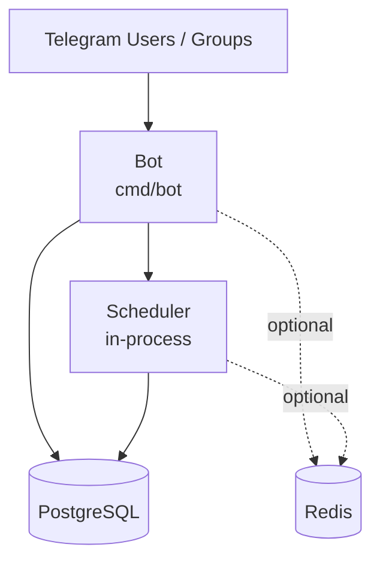

# Sola

中文（简体） | [English](./README.en.md)

[](./LICENSE)
[](https://t.me/+gbitAgNwtRtlYjZh)
[](https://go.dev/)
[](https://core.telegram.org/bots)

Sola 是一套面向 Telegram 群组运营的开源 Bot，采用 **单 Bot 进程内置后台调度器** 架构，适合单人长期运营、持续迭代的 Telegram 群产品，而不是一次性脚本机器人。

## 功能总览

| 模块 | 已实现能力 |
|------|-----------|
| **积分** | 按消息类型计分、冷却防刷、排行榜、流水查询、手动调分、签到 |
| **群管** | 封禁/解封/禁言/踢出/警告、批量删消息、欢迎语、管理员提升/降级/头衔、清理注销账号 |
| **入群验证** | 6 种验证类型（按钮/验证码/多选/Poll/数学题/Cloudflare Turnstile Mini App） |
| **风控审核** | 关键词过滤、链接限制、未验证用户限制、AI 广告二次判定（OpenAI 兼容接口）、违规记录 |
| **内容运营** | 自动回复、消息模板、邀请链接追踪、等级成长体系、sed 行内文本修正 |
| **定时发帖** | 一次性/循环任务、富媒体（图文/视频/文件）、Inline Keyboard、自动删除 |
| **抽奖** | 按钮/口令参与、群内公告、后台调度器自动开奖（`poll_answer` 实时接收） |
| **工程基础** | Docker Compose、SQL migrations、多租户隔离、Owner 归属校验、细粒度管理员权限 |

## 架构概览



## 技术栈

| 层次 | 技术 |
|------|------|
| 后端 | Go · gotgbot/v2 · GORM · gocron |
| 存储 | PostgreSQL · Redis（可选） |
| 部署 | Docker · Docker Compose |

## 目录结构

```text
cmd/
  bot/        Telegram Bot 入口（内置后台调度器）
internal/
  bot/        Telegram handler、命令、交互流程
  config/     配置加载
  model/      GORM 模型
  service/    业务逻辑
  store/      DB / Redis 初始化（Redis 可选）
database/
  migrations/ SQL 迁移脚本（按文件名顺序执行）
```

## 快速开始

### 1. 配置环境变量

```bash
cp .env.example .env
```

> **注意**：服务器不需要 `config.yaml`，所有配置均可通过环境变量设置。`config.yaml` 仅在本地开发时使用，生产环境使用 `.env` 即可。

**必填项：**

| 变量 | 说明 |
|------|------|
| `SOLA_BOT_TOKEN` | Telegram Bot Token（从 @BotFather 获取） |
| `SOLA_DATABASE_DSN` | PostgreSQL 连接字符串 |

**Cloudflare Turnstile 验证（可选，启用 `turnstile` 验证类型时必填）：**

| 变量 | 说明 |
|------|------|
| `SOLA_BOT_MINI_APP_URL` | Mini App 地址，用于生成验证链接 |
| `SOLA_TURNSTILE_SITE_KEY` | Cloudflare Dashboard → Turnstile 获取 |
| `SOLA_TURNSTILE_SECRET_KEY` | Cloudflare Dashboard → Turnstile 获取 |
| `SOLA_TURNSTILE_VERIFY_SECRET` | 链接签名密钥，随机 32 字节即可：`openssl rand -base64 32` |

### 2. 启动全部服务

```bash
docker compose up -d --build
```

Compose 会按顺序启动：`postgres` → `migrate`（执行尚未应用的 `*.up.sql`）→ `bot`。Redis 服务保留为可选能力，需要时配置 `SOLA_REDIS_ADDR` 即可启用。

### 3. 本地开发

```bash
go run ./cmd/bot
```

## 入群验证

使用 `/set_verify type <类型>` 配置验证方式：

| 类型 | 验证方式 |
|------|---------|
| `button` | 点击「我是人类」按钮即可通过 |
| `captcha` | 输入随机数字验证码 |
| `multi_choice` | 自定义题目 + 多选按钮 |
| `poll` | Telegram 原生测验投票 |
| `math` | 随机算式 4 选 1 |
| `turnstile` | Cloudflare Turnstile + Mini App：用户申请入群时收到含 WebApp 按钮的私信，完成人机验证后自动批准入群 |

> **启用 `turnstile` 前置条件**：需配置上方 Turnstile 环境变量，且群组须开启「加入前需批准（Join Request）」。

附加配置：
- `/set_verify difficulty easy|medium|hard` — 调整超时时间与重试次数
- `/allowuser @user` — 将用户加入白名单，跳过验证
- `/verify_stats` — 查看今日通过/拒绝/超时统计

## Bot 命令参考

<details>
<summary>展开查看完整命令列表</summary>

**基础**：`/start` `/menu` `/settings` `/help` `/info` `/bind` `/check_admin`

**积分**：`/points` `/rank` `/sign` `/points_config` `/set_points` `/set_cooldown` `/points_toggle`

**群管**：`/ban` `/bans` `/unban` `/mute` `/unmute` `/kick` `/warn` `/warns` `/unwarn` `/purge` `/del` `/promote` `/demote` `/set_title` `/report` `/ban_ghosts` `/violations` `/resolve_violation` `/ignore_violation`

**验证**：`/adminconfig` `/set_welcome` `/set_warn_limit` `/verify_toggle` `/set_verify` `/verify_stats`

**群规**：`/setrules` `/clearrules` `/rules`

**内容运营**：`/add_keyword` `/del_keyword` `/keywords` `/add_reply` `/del_reply` `/replies` `/add_template` `/del_template` `/templates` `/invite_create` `/invite_delete` `/invites` `/set_level` `/levels` `/add_level` `/del_level`

**发帖**：`/posts` `/publish` `/post_create` `/post_toggle` `/post_delete`

**抽奖**：`/lottery`

**统计**：`/stat` `/stat_week` `/stats`

</details>

## 安全说明

- 群资源操作会尽量校验 Telegram 管理员身份和 Owner 归属
- 群管操作（封禁/禁言/踢出/关键词命中）自动写入 `audit_logs`
- Redis 可选，用于冷却、缓存和部分限流能力；不配置 Redis 时 Bot 仍可启动

**正式上线前建议**：配置 TLS 和域名、为 PostgreSQL 配置持久化；如启用 Redis，也请配置 Redis 持久化；先在测试群验证所有核心链路。

## 数据库与迁移

所有表结构变更通过 `database/migrations/` 管理，生产环境不依赖运行时 `AutoMigrate`。Docker Compose 的 `migrate` 服务会在启动时自动按文件名顺序执行尚未应用的 `*.up.sql`。

不使用 Compose 时，需手动按顺序执行 `database/migrations/` 下的 SQL 文件，升级时只执行新增的迁移。

## 更新日志

- **2026-06-20** v2.1.0 — 私聊面板全按钮化重构（@xiaoku 风格）：工作台扩展为 16 个按钮 2 列网格，支持在私聊中完成进群验证开关与类型切换、欢迎语修改、群规修改、关键词/自动回复查看、邀请链接、等级规则、群管状态与记录等所有配置；群内 BotFather 命令精简为成员命令，管理操作统一通过私聊面板
- **2026-06-20** v2.0.1 — 修复 mute 命令裸数字时长解析、UseIndependentChatPermissions 兼容性、管理员权限校验返回非空错误、audit_logs 缺失列、keyword_filter 删消息逻辑；补充超群 ID 迁移 migration 000025
- **2026-06-18** v2.0.0 — 重构为纯 Bot 架构：删除 Web 管理面板，合并 bot+worker 为单进程，Redis 变为可选
- **2026-06-18** v1.0.4 — 修复10个前端bug（积分配置卡死、Cron步长语法、关键词过滤联动、封禁页空态与加载、抽奖数据竞争、侧边栏记忆等），新增群组解绑、禁言操作、统计自定义日期、Bot全局配置四项功能
- **2026-06-18** v1.0.3 — 修复关键词过滤未删消息、抽奖创建后无群公告、入群验证按钮无反应、/lottery 命令无响应四个 bug
- **2026-06-17** v1.0.2 — 修复 Worker 调度死锁（runDueJobs 持锁时调用 increment/resetScheduledPostFailure 导致自锁）；修复用户管理详情抽屉调分后积分不刷新；修复用户管理 chat_id/user_id 类型错误及静默吞错
- **2026-06-17** v1.0.1 — 修复 Worker 启动时同步执行 runDueJobs 导致 Telegram API 慢调用阻塞整个调度器的问题；补充 migration 000022（chat_admin_configs 缺少 verify_type 列）
- **2026-06-17** v1.0.0 — 新增网页端系统设置（Turnstile 密钥、管理员密码可在后台修改）；修复 config.yaml 缺失导致启动崩溃；修复机器人信息显示；修复 Mini App 构建与 Docker volume 挂载

## 贡献方式

欢迎提交 Issue 和 Pull Request。

1. 不提交真实密钥、运行数据和本地日志
2. 改动尽量小而聚焦，行为变化时同步更新文档
3. 数据库结构变更请配套 `*.up.sql` / `*.down.sql`

## License

MIT · See [LICENSE](./LICENSE)
